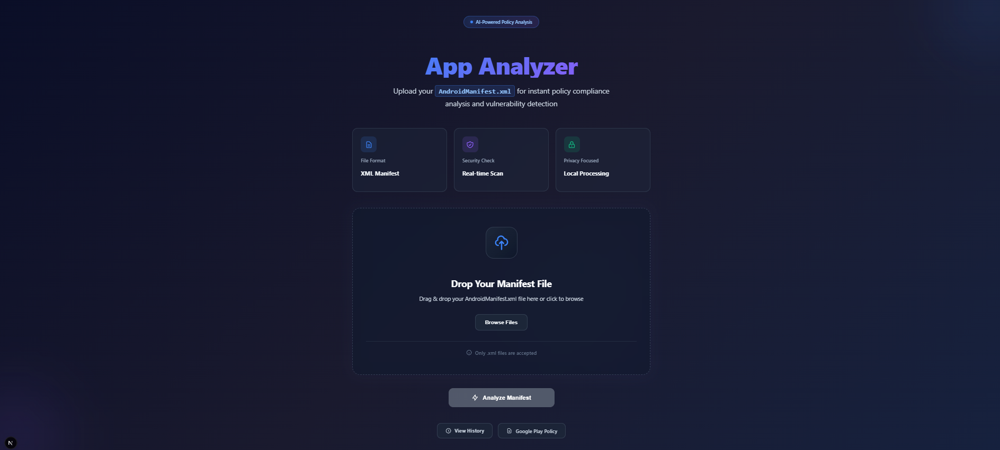
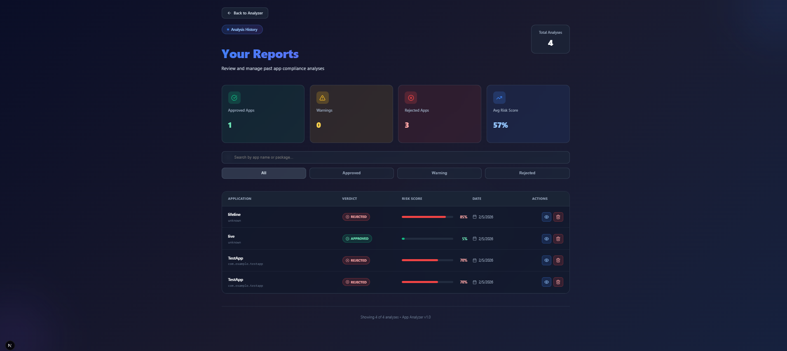
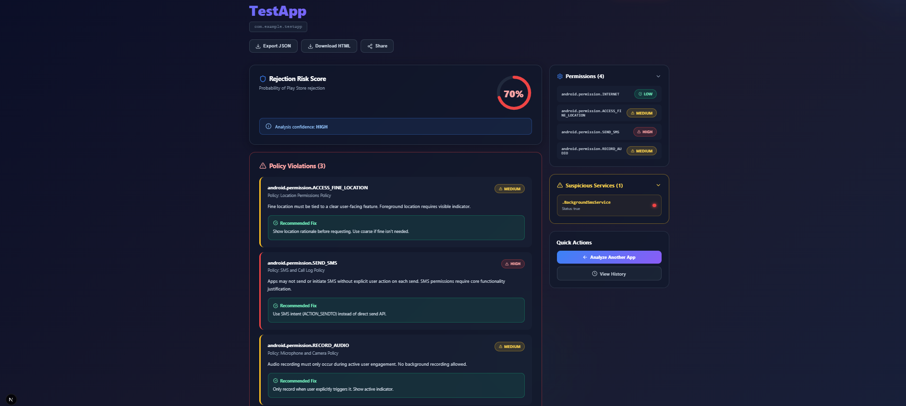

# Play Store App Analyzer

An AI-powered system that analyzes Android app manifests for Google Play policy violations and generates realistic reviewer comments using a fine-tuned LLM with RAG (Retrieval-Augmented Generation).


## 🎯 Features

- **Permission Analysis**: Automatically classifies Android permissions by risk level (HIGH/MEDIUM/LOW)
- **Policy Violation Detection**: Cross-references permissions against Google Play policies (SMS, Location, User Data, etc.)
- **Rejection Probability Scoring**: Calculates likelihood of app rejection based on severity and number of violations
- **RAG-Enhanced Context**: Retrieves relevant policy documentation to ground LLM responses
- **Fine-Tuned LLM**: Custom-trained Llama 3.2 model generates professional reviewer comments
- **Full-Stack Dashboard**: Next.js frontend with upload, detailed reports, and history tracking

## 🏗️ Architecture

```
                  ┌─────────────────┐
                  │   Next.js UI    │  ← Upload manifest, view reports
                  └────────┬────────┘
                           │
                  ┌────────▼────────┐
                  │   Django API    │  ← Orchestrates the pipeline
                  └────────┬────────┘
                           │
             ┌────▼──────────────────────────────────┐
             │                                       │
         ┌───▼────────┐  ┌──────────┐  ┌───────────▼──┐
         │  Analyzer  │  │   RAG    │  │   Fine-Tuned │
         │   Engine   │  │  Vector  │  │   LLM(Ollama)│
         │            │  │  Store   │  │              │
         │ • Parser   │  │ • Policy │  │ • Llama 3.2  │
         │ • Risk     │  │   Docs   │  │ • LoRA       │
         │ • Verdict  │  │ • Embed  │  │ • GGUF       │
         └────────────┘  └──────────┘  └──────────────┘
```

## 🚀 Quick Start

### Prerequisites

- **Python 3.14+**
- **Node.js 22.20+**
- **Ollama** (for running the fine-tuned model locally)
- **Google Colab** (for fine-tuning, requires GPU)

### Installation

1. **Clone the repository**
```bash
git clone https://github.com/Jawadyyy/play-store-reviewer.git
cd play-store-reviewer
```

2. **Set up Python environment**
```bash
python -m venv venv
source venv/bin/activate

pip install lxml sentence-transformers requests
pip install django djangorestframework django-cors-headers python-dotenv
```

3. **Set up Frontend**
```bash
cd frontend
npm install
cd ..
```

4. **Configure environment variables**

Create `.env` in the project root:

5. **Embed policy documents**
```bash
cd rag
python embedder.py
cd ..
```

6. **Initialize database**
```bash
cd backend
python manage.py makemigrations api
python manage.py migrate
cd ..
```

### Running the Application

**Terminal 1: Start Ollama** (must be running first)
```bash
ollama serve
```

**Terminal 2: Start Django Backend**
```bash
cd backend
python manage.py runserver
# Backend runs at http://127.0.0.1:8000
```

**Terminal 3: Start Next.js Frontend**
```bash
cd frontend
npm run dev
```

## 🧠 Fine-Tuning the Model

The project includes a fine-tuned Llama 3.2 3B model trained on Google Play reviewer comments.

### Training Dataset

The training dataset is located at `models/dataset/play_reviewer_dataset.json` and contains 15 examples of:
- Input: App metadata, verdict, policy issues
- Output: Professional reviewer comments with remediation steps

**Format:**
```json
{
  "input": "App: com.example.sms_app | Verdict: REJECTED | Issues: [SEND_SMS - HIGH]",
  "output": "Your app has been flagged for policy violation. The permission android.permission.SEND_SMS..."
}
```

**Load into Ollama**:
```bash
cd models
ollama create play-reviewer -f Modelfile
ollama list
```

## 📁 Project Structure

```
play-store-reviewer/
├── analyzer/                   # Core analysis engine
│   ├── manifest_parser.py     # XML parser & analyzer
│   ├── risk_rules.py          # Permission risk classification
│   ├── policy_map.py          # Policy violation database
│   └── verdict_engine.py      # Rejection probability calculator
│
├── rag/                       # Retrieval-Augmented Generation
│   ├── policy_docs/           # Google Play policy text files
│   ├── chunker.py             # Document chunking logic
│   ├── vector_store.py        # Custom vector database
│   ├── embedder.py            # Sentence-Transformer embedding
│   └── retriever.py           # Semantic search & context builder
│
├── models/                    # Fine-tuning & inference
│   ├── dataset/
│   │   └── play_reviewer_dataset.json  # Training data
│   ├── Modelfile              # Ollama model config
│   └── play-reviewer.gguf     # Fine-tuned model (after training)
│
├── backend/                   # Django REST API
│   ├── api/
│   │   ├── models.py          # Database schema
│   │   ├── views.py           # API endpoints
│   │   ├── serializers.py     # JSON serialization
│   │   └── urls.py            # Route definitions
│   ├── config/
│   │   └── settings.py        # Django configuration
│   └── manage.py
│
├── frontend/                  # Next.js dashboard
│   ├── src/
│   │   ├── app/
│   │   │   ├── page.tsx       # Upload page
│   │   │   ├── report/[id]/page.tsx  # Report details
│   │   │   └── history/page.tsx      # Analysis history
│   │   └── lib/
│   │       └── api.ts         # Backend API client
│   └── package.json
│
├── .env                       # Environment variables
└── AndroidManifest.xml        # Test manifest file
```

## 🎨 Frontend Preview

### Upload Page
Clean, drag-and-drop interface for uploading AndroidManifest.xml files



### Report Page
Detailed analysis showing:
- Verdict badge (REJECTED / WARNING / APPROVED)
- Rejection probability meter
- Permissions list with risk badges
- Policy violations with fixes
- Suspicious services detection
- AI-generated reviewer comment



### History Page
Sortable table of all past analyses with quick access to reports




